# Tema 5. Rendimiento de la jerarquía de memoria

---

## Índice

1. [Objetivos de aprendizaje](#objetivos-de-aprendizaje)
2. [Mapa general del tema](#mapa-general-del-tema)
3. [5.1. Introducción](#51-introducción)
4. [5.2. Jerarquía de memoria](#52-jerarquía-de-memoria)
5. [5.3. Memoria caché](#53-memoria-caché)
6. [5.4. Mejoras del rendimiento de la memoria principal](#54-mejoras-del-rendimiento-de-la-memoria-principal)
7. [5.5. Memoria virtual](#55-memoria-virtual)
8. [5.6. Jerarquía de memoria en arquitecturas actuales](#56-jerarquía-de-memoria-en-arquitecturas-actuales)
9. [Ejercicios resueltos](#ejercicios-resueltos)
10. [Ejercicios propuestos](#ejercicios-propuestos)
11. [Resumen final](#resumen-final)
12. [Glosario](#glosario)
13. [Preguntas de repaso / examen](#preguntas-de-repaso--examen)
14. [Bibliografía y referencias](#bibliografía-y-referencias)
15. [Qué ha cambiado desde el enfoque clásico hasta las arquitecturas actuales](#qué-ha-cambiado-desde-el-enfoque-clásico-hasta-las-arquitecturas-actuales)

---

## Objetivos de aprendizaje

Al finalizar el estudio de este tema, el estudiante será capaz de:

1. **Explicar** el principio de localidad y su papel como fundamento de la jerarquía de memoria.
2. **Definir** los conceptos de acierto, fallo, tasa de fallos, penalización de fallo y tiempo medio de acceso a memoria (TMA).
3. **Describir** las tres organizaciones principales de la caché (directa, completamente asociativa y asociativa por conjuntos) y comparar sus ventajas, desventajas y compromisos.
4. **Calcular** las métricas cuantitativas fundamentales: TMA, CPI de memoria y TCPU, interpretando su significado.
5. **Clasificar** los fallos de caché según la taxonomía de las tres C (forzosos, capacidad y conflicto) y proponer técnicas para reducirlos.
6. **Comparar** write-through y write-back, justificando cuándo conviene cada política.
7. **Explicar** las técnicas de mejora del rendimiento de la memoria principal: memoria ancha, entrelazada y bancos independientes.
8. **Describir** los fundamentos de la memoria virtual: paginación, traducción de direcciones, TLB y gestión de fallos de página.
9. **Analizar** la jerarquía de memoria en plataformas modernas (Apple Silicon, ARM Cortex, RISC-V), distinguiendo entre ISA y microarquitectura.
10. **Resolver** ejercicios cuantitativos de complejidad creciente sobre diseño y rendimiento de la jerarquía de memoria.

---

## Mapa general del tema

Este tema aborda el **rendimiento del sistema de memoria** como factor determinante del rendimiento global de un computador. La idea central es que el procesador es muy rápido, pero la memoria es comparativamente lenta, y esta diferencia —conocida como *memory wall*— obliga a diseñar una **jerarquía de niveles de memoria** que explote el principio de localidad para acercar al procesador los datos que más probablemente va a necesitar.

El tema se organiza en cinco grandes bloques clásicos y una sección de actualización moderna:

| Sección | Contenido principal |
|:---|:---|
| 5.1 | Motivación: localidad, coste, velocidad, capacidad |
| 5.2 | Definiciones cuantitativas: acierto, fallo, TMA |
| 5.3 | Memoria caché: organización, políticas, rendimiento |
| 5.4 | Mejoras en memoria principal: ancho de banda, entrelazado |
| 5.5 | Memoria virtual: paginación, TLB, protección |
| 5.6 | Arquitecturas modernas: Apple Silicon, ARM, RISC-V |

Cada sección se apoya en la anterior: la jerarquía de memoria (5.2) motiva la caché (5.3) y las mejoras de la DRAM (5.4); la memoria virtual (5.5) integra todo con el sistema operativo; y la sección moderna (5.6) muestra cómo se materializan estos principios hoy.

---

## 5.1. Introducción

### 5.1.1. El problema fundamental: la brecha procesador-memoria

En las últimas décadas, la velocidad de los procesadores ha crecido mucho más rápido que la de las memorias DRAM. Mientras que el rendimiento de los procesadores se duplicaba cada uno o dos años, la latencia de la DRAM solo mejoraba alrededor de un 7% anual. Esta divergencia, denominada **memory wall** (muro de memoria), tiene una consecuencia directa: si el procesador tuviera que esperar a la memoria principal en cada acceso, pasaría la mayor parte del tiempo bloqueado, desaprovechando su capacidad de cómputo.

> **Analogía cotidiana**
> Imagina un cocinero extraordinariamente rápido trabajando en una cocina donde los ingredientes están en un almacén al otro lado de la ciudad. No importa lo rápido que cocine: si cada vez que necesita un ingrediente debe ir a buscarlo lejos, su productividad real será baja. La solución natural es tener a mano los ingredientes más frecuentes en la encimera y los demás en un armario cercano.

En términos de arquitectura de computadores, esto significa que necesitamos una **jerarquía de memorias** de distinto tamaño, velocidad y coste, colocando cerca del procesador memorias pequeñas pero muy rápidas (cachés), y más lejos memorias grandes pero más lentas (DRAM, disco).

### 5.1.2. Principio de localidad

El funcionamiento de la jerarquía de memoria se sustenta en una observación empírica fundamental: los programas no acceden a todas las posiciones de memoria con igual probabilidad. Este comportamiento predecible se denomina **principio de localidad** y tiene dos formas:

**Localidad temporal:** si un dato ha sido accedido recientemente, es probable que se vuelva a acceder en un futuro cercano. Por ejemplo, las variables de un bucle se leen y escriben en cada iteración.

**Localidad espacial:** si se ha accedido a una dirección de memoria, es probable que se acceda pronto a direcciones cercanas. Por ejemplo, al recorrer un array, los elementos se leen en orden secuencial, ocupando posiciones contiguas.

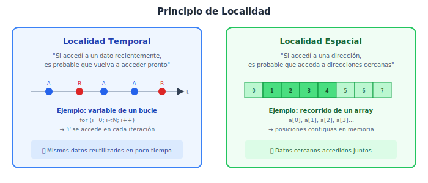

*Figura 5.1. Los dos tipos de localidad. A la izquierda, localidad temporal: el mismo dato A se reutiliza varias veces. A la derecha, localidad espacial: el acceso a un elemento del array provoca que se traigan a caché los elementos vecinos.*

> **Ejemplo cotidiano**
> Piensa en tu escritorio de estudio. Los apuntes que estás repasando ahora (localidad temporal) y los de las páginas siguientes del mismo tema (localidad espacial) están sobre la mesa. Los libros de otras asignaturas están en la estantería, y los apuntes del curso pasado en una caja del trastero. Este patrón es exactamente el que sigue la jerarquía de memoria.

**Retorno al concepto técnico:** en un computador, la localidad temporal justifica mantener en caché los datos recientemente accedidos, y la localidad espacial justifica que, al traer un dato de memoria, se traiga un bloque completo de datos contiguos.

### 5.1.3. Compromiso entre coste, capacidad y velocidad

No existe una tecnología de memoria que sea simultáneamente rápida, grande y barata. El diseño de la jerarquía de memoria es un **compromiso de ingeniería** entre tres ejes en tensión:

| Propiedad | Memoria rápida (SRAM) | Memoria densa (DRAM) | Almacenamiento (SSD/Disco) |
|:---|:---|:---|:---|
| Tiempo de acceso | ~1 ns | ~50-100 ns | ~10⁴-10⁷ ns |
| Coste por GB | Muy alto (~$500-1000/GB) | Moderado (~$3-5/GB) | Bajo (~$0.05-0.20/GB) |
| Capacidad típica | KB-MB | GB | TB |
| Volatilidad | Volátil | Volátil | No volátil |

La jerarquía de memoria resuelve este conflicto distribuyendo los datos en niveles, de modo que el sistema se comporta *como si* tuviera una memoria tan rápida como el nivel superior y tan grande como el nivel inferior. Este comportamiento es posible gracias a que, la mayor parte del tiempo, los accesos se resuelven en los niveles más cercanos al procesador (por el principio de localidad).

### 5.1.4. Idea general del rendimiento de memoria

El rendimiento global de un computador no depende solo de la velocidad del procesador, sino también —y de forma decisiva— de la velocidad con que puede obtener datos e instrucciones de la memoria. La ecuación fundamental del rendimiento conecta ambos aspectos:

$$T_{CPU} = N_{instrucciones} \times CPI \times T_{ciclo}$$

donde el CPI (ciclos por instrucción) incluye tanto los ciclos de ejecución de la instrucción como los ciclos que el procesador queda bloqueado esperando a la memoria (stalls de memoria). Reducir esos stalls es precisamente el objetivo de la jerarquía de memoria.

> **Mini conclusión**: la jerarquía de memoria existe porque la DRAM es demasiado lenta para el procesador, pero el principio de localidad permite diseñar un sistema de memorias pequeñas y rápidas (cachés) que, bien gestionadas, capturan la mayoría de los accesos y reducen drásticamente el tiempo efectivo de acceso a memoria.

---

## 5.2. Jerarquía de memoria

### 5.2.1. Estructura general

La jerarquía de memoria es una organización de niveles de almacenamiento ordenados de menor a mayor capacidad (y de mayor a menor velocidad). En un computador moderno típico, la organización es:

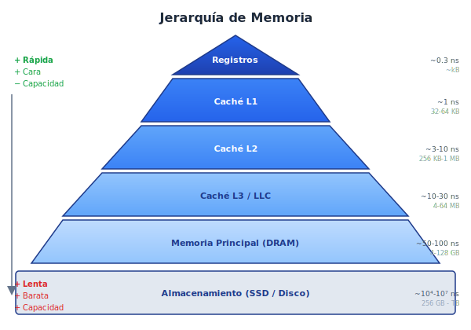

*Figura 5.2. Jerarquía de memoria piramidal. Los niveles superiores son más rápidos, más pequeños y más caros por byte. Los niveles inferiores son más lentos, más grandes y más baratos.*

La jerarquía funciona por un principio de **inclusión**: en cada instante, los datos accedidos con más frecuencia tienden a estar en los niveles superiores, replicados desde los niveles inferiores. El procesador busca siempre primero en el nivel más cercano; si no encuentra el dato, desciende al siguiente nivel.

> **Analogía cotidiana**
> Imagina una mochila, un armario y un almacén:
> - En la **mochila** (registros/L1) llevas solo lo imprescindible para la clase de hoy: pocos objetos, acceso instantáneo.
> - En el **armario** de tu habitación (L2/L3) tienes la ropa de la temporada: más cosas, algo más de tiempo para buscar.
> - En el **almacén** del sótano (DRAM) guardas todo lo que no usas a diario.
> - En el **trastero** de otra ciudad (disco/SSD) están las cosas que casi nunca necesitas.
>
> Si necesitas algo del almacén, tardas más; si es del trastero, la espera es enorme. La clave es anticipar qué vas a necesitar y tenerlo ya en la mochila.

Técnicamente, la analogía corresponde a que los niveles superiores de la jerarquía tienen menor latencia y menor capacidad, y los datos se promueven hacia arriba cuando se acceden.

### 5.2.2. Definiciones básicas

Antes de cuantificar el rendimiento, es necesario definir con precisión los términos fundamentales:

**Bloque (o línea de caché):** es la unidad mínima de transferencia entre dos niveles consecutivos de la jerarquía. Un bloque contiene varios bytes contiguos de memoria (valores típicos: 32, 64 o 128 bytes). Cuando se produce un fallo, se transfiere un bloque completo, no un solo byte.

**Acierto (hit):** se produce cuando el dato solicitado por el procesador se encuentra en el nivel de memoria consultado. El acceso se resuelve rápidamente.

**Fallo (miss):** se produce cuando el dato solicitado NO está en el nivel consultado. Es necesario buscarlo en un nivel inferior, lo que implica una penalización en tiempo.

**Tasa de aciertos (hit rate):**

$$h = \frac{\text{número de aciertos}}{\text{número total de accesos}}$$

**Tasa de fallos (miss rate):**

$$m = 1 - h = \frac{\text{número de fallos}}{\text{número total de accesos}}$$

**Tiempo de acierto ($t_a$):** el tiempo necesario para acceder al dato cuando está presente en el nivel consultado. Incluye el tiempo de comparar la etiqueta y leer el dato. Valores típicos: 1-3 ciclos para L1.

**Penalización de fallo ($p_f$):** el tiempo adicional que se tarda en obtener el dato del nivel inferior cuando se produce un fallo. Incluye el tiempo de acceder al nivel inferior, transferir el bloque y colocarlo en el nivel superior. Valores típicos: 10-200 ciclos.

> **Ejemplo cotidiano**: buscar una palabra en un diccionario que tienes sobre la mesa (hit) tarda unos segundos. Si no lo tienes, debes ir a la estantería (miss), lo cual lleva más tiempo. La penalización de fallo es el tiempo extra que tardas en ir, buscar el diccionario y volver.

Llevado al caso de la caché, el procesador busca un dato en L1; si está, lo obtiene en ~1 ciclo (hit); si no, debe buscarlo en L2 o en memoria principal, lo que puede costar decenas o cientos de ciclos (penalización de fallo).

### 5.2.3. Tiempo medio de acceso a memoria (TMA)

La métrica central para evaluar el rendimiento de un nivel de la jerarquía es el **tiempo medio de acceso a memoria** (TMA, o AMAT en inglés: *Average Memory Access Time*):

$$TMA = t_a + m \times p_f$$

donde:
- $t_a$ = tiempo de acierto (hit time)
- $m$ = tasa de fallos (miss rate)
- $p_f$ = penalización de fallo (miss penalty)

**Interpretación:** el TMA es el tiempo promedio que tarda cada acceso a memoria, ponderando los aciertos (que solo cuestan $t_a$) y los fallos (que cuestan $t_a + p_f$). Cuanto menor sea el TMA, mejor será el rendimiento del sistema de memoria.

> **Ejemplo numérico:**
> Si $t_a = 1$ ciclo, $m = 5\%$ y $p_f = 100$ ciclos:
>
> $TMA = 1 + 0{,}05 \times 100 = 1 + 5 = 6$ ciclos
>
> Esto significa que, en promedio, cada acceso a memoria cuesta 6 ciclos, aunque la caché sola responde en 1 ciclo. El 5% de fallos multiplica por 6 el tiempo medio.

**Importancia para el rendimiento:** un TMA alto degrada gravemente el rendimiento, porque el procesador pasa muchos ciclos esperando datos. Reducir la tasa de fallos o la penalización de fallo tiene un impacto directo y cuantificable en la velocidad del sistema.

### 5.2.4. Relación entre tamaño de bloque, acceso y rendimiento

El tamaño del bloque influye de forma no trivial en el rendimiento:

- **Bloques más grandes** aprovechan mejor la localidad espacial (se traen más datos contiguos), lo que reduce los fallos forzosos. Sin embargo, si el bloque es demasiado grande:
  - La penalización de fallo aumenta (se tarda más en transferir un bloque grande).
  - Si la caché tiene tamaño fijo, caben menos bloques, lo que puede aumentar los fallos de capacidad y conflicto.
  - Se puede traer datos que no se usan (*polución* de caché).

- **Bloques más pequeños** tienen menor penalización de fallo pero no aprovechan bien la localidad espacial.

El diseño óptimo busca un punto intermedio. Los tamaños más habituales en cachés modernas son 32 o 64 bytes.

> **Mini conclusión**: las definiciones de acierto, fallo, tasa de fallos, penalización de fallo y TMA constituyen el vocabulario cuantitativo imprescindible para evaluar cualquier nivel de la jerarquía de memoria. El TMA integra todos estos factores en una única métrica de rendimiento.

---

## 5.3. Memoria caché

La **memoria caché** es el nivel de la jerarquía de memoria situado entre el procesador y la memoria principal. Su objetivo es almacenar copias de los bloques de memoria más probablemente necesarios para que el procesador los obtenga rápidamente, sin esperar a la DRAM.

La caché debe responder a cuatro preguntas de diseño:
1. **¿Dónde puede ubicarse un bloque?** → Política de correspondencia (placement).
2. **¿Cómo se encuentra un bloque?** → Mecanismo de búsqueda (identification).
3. **¿Qué bloque se expulsa cuando la caché está llena?** → Política de reemplazo (replacement).
4. **¿Qué ocurre cuando se escribe un dato?** → Política de escritura (write policy).

### 5.3.1. Organización general

Una caché se compone de un conjunto de **líneas** (o entradas). Cada línea contiene:
- Un **bit de validez (V):** indica si la línea contiene un bloque válido.
- Una **etiqueta (tag):** identifica qué bloque de memoria está almacenado en esa línea.
- Un **bloque de datos:** los bytes del bloque copiados de memoria.
- (Opcionalmente) un **bit dirty:** en write-back, indica si el bloque ha sido modificado.

### 5.3.2. Ubicación de bloque: las tres organizaciones

#### Correspondencia directa (Direct Mapping)

En la **correspondencia directa**, cada bloque de memoria puede ir a **una única línea** de la caché, determinada por:

$$\text{línea} = \text{dirección del bloque} \mod N_{\text{líneas}}$$

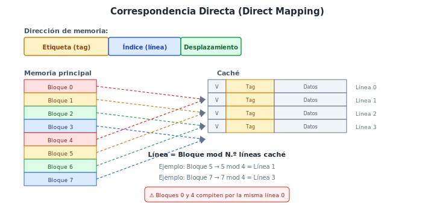

*Figura 5.3. Correspondencia directa. Cada bloque de memoria solo puede ocupar una línea determinada. Bloques distintos que se mapean a la misma línea provocan conflictos.*

**Ventajas:**
- Hardware sencillo y rápido: solo se compara una etiqueta.
- Menor coste y menor consumo de energía.

**Desventajas:**
- Alta tasa de fallos de conflicto: dos bloques que compitan por la misma línea se expulsan mutuamente, incluso habiendo líneas vacías.

> **Analogía cotidiana**: es como un aparcamiento donde cada coche tiene asignada una plaza fija. Si dos coches tienen la misma plaza asignada, solo puede quedarse uno; el otro debe esperar fuera, aunque haya plazas vacías en otra zona.

En términos de arquitectura de computadores, esto significa que en correspondencia directa un bloque solo tiene una opción de ubicación, sin alternativa posible, lo que genera los fallos de conflicto.

#### Correspondencia completamente asociativa (Fully Associative)

En la **correspondencia completamente asociativa**, un bloque de memoria puede colocarse en **cualquier línea** de la caché.

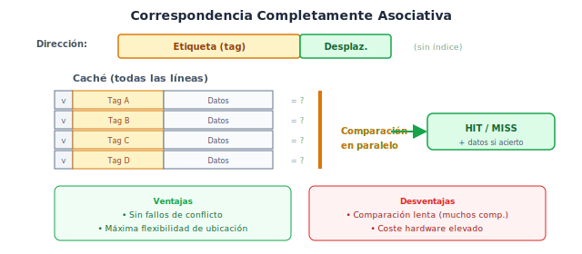

*Figura 5.4. Correspondencia completamente asociativa. Cada bloque puede ir a cualquier línea. No hay fallos de conflicto, pero buscar el bloque exige comparar la etiqueta con todas las líneas en paralelo.*

**Ventajas:**
- No existen fallos de conflicto: no se expulsa un bloque por su posición, solo por capacidad.

**Desventajas:**
- Requiere comparar la etiqueta con todas las líneas simultáneamente, lo que exige comparadores en paralelo y aumenta coste, consumo y tiempo de acceso.
- Solo es práctico para cachés muy pequeñas (por ejemplo, TLBs).

> **Analogía cotidiana**: es como un aparcamiento libre donde cada coche puede aparcar en cualquier plaza. Es muy flexible, pero encontrar tu coche requiere recorrer todo el aparcamiento.

Técnicamente, la analogía corresponde a que la búsqueda requiere una comparación exhaustiva de todas las etiquetas, cosa que solo es viable con hardware dedicado y cachés de pocas entradas.

#### Correspondencia asociativa por conjuntos (Set-Associative)

La **correspondencia asociativa por conjuntos** (n-way set-associative) es un compromiso: la caché se divide en conjuntos, cada uno con n líneas (n vías). Un bloque se mapea a un conjunto fijo, pero dentro de ese conjunto puede ocupar cualquiera de las n vías.

$$\text{conjunto} = \text{dirección del bloque} \mod N_{\text{conjuntos}}$$

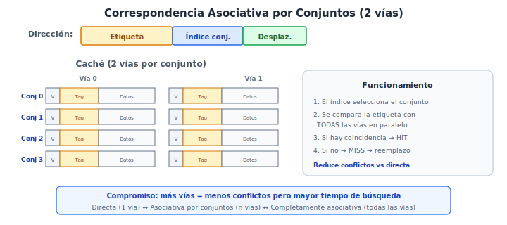

*Figura 5.5. Correspondencia asociativa por conjuntos de 2 vías. El índice selecciona el conjunto; la etiqueta se compara con las 2 vías del conjunto en paralelo.*

**Ventajas:**
- Reduce los fallos de conflicto respecto a correspondencia directa.
- Hardware más realista que la completamente asociativa.

**Desventajas:**
- Más comparadores que la directa (uno por vía).
- Algo más lenta y cara que la directa.

> **Nota**
> La correspondencia directa es un caso particular de asociativa por conjuntos con 1 vía.
> La completamente asociativa es un caso particular con un único conjunto de n líneas.
> La asociativa por conjuntos de 2 a 16 vías es la configuración estándar en cachés modernas.

**Tabla comparativa:**

| Organización | N.º comparaciones | Fallos de conflicto | Coste / Complejidad | Uso típico |
|:---|:---|:---|:---|:---|
| Directa | 1 | Altos | Bajo | Cachés L1 simples |
| Asoc. por conjuntos (n vías) | n | Moderados | Medio | L1, L2, L3 modernas |
| Completamente asociativa | Todas las líneas | Ninguno | Alto | TLBs, cachés muy pequeñas |

### 5.3.3. Cómo se encuentra un bloque: etiqueta, índice y desplazamiento

Para localizar un dato en la caché, la dirección de memoria se descompone en tres campos:

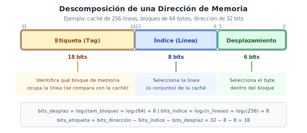

*Figura 5.6. Descomposición de una dirección de 32 bits para una caché de correspondencia directa con 256 líneas y bloques de 64 bytes.*

- **Desplazamiento (offset):** selecciona el byte dentro del bloque. Número de bits: $\log_2(\text{tamaño del bloque})$.
- **Índice:** selecciona la línea (o el conjunto) de la caché. Número de bits: $\log_2(\text{número de líneas o conjuntos})$.
- **Etiqueta (tag):** identifica de forma unívoca qué bloque de memoria está almacenado. Bits restantes: $\text{bits de dirección} - \text{bits de índice} - \text{bits de desplazamiento}$.

**Proceso de búsqueda:**
1. Se extrae el **índice** de la dirección y se accede a la línea (o conjunto) correspondiente.
2. Se compara la **etiqueta** almacenada con la etiqueta de la dirección solicitada.
3. Si coinciden y el **bit de validez** es 1, hay **acierto** (hit): se usa el campo de **desplazamiento** para localizar el byte dentro del bloque.
4. Si no coinciden o el bit de validez es 0, hay **fallo** (miss): se trae el bloque del nivel inferior.

> **Ejemplo técnico breve**
> Dirección de 32 bits, caché de 1024 líneas, bloque de 32 bytes:
> - Bits desplazamiento: $\log_2(32) = 5$
> - Bits índice: $\log_2(1024) = 10$
> - Bits etiqueta: $32 - 10 - 5 = 17$

### 5.3.4. Estrategias de reemplazo

Cuando se produce un fallo y la línea (o todas las vías del conjunto) está ocupada, hay que decidir qué bloque se expulsa. Las estrategias principales son:

- **LRU (Least Recently Used):** se expulsa el bloque que hace más tiempo que no se accede. Es la estrategia más eficaz pero la más costosa, porque hay que mantener un registro del orden de acceso.
- **FIFO (First In, First Out):** se expulsa el bloque que lleva más tiempo en la caché, independientemente de si se ha usado recientemente. Más simple que LRU pero menos eficaz.
- **Aleatoria (Random):** se elige al azar. Sorprendentemente competitiva en cachés con muchas vías y mucho más simple de implementar.

> **Nota**
> En correspondencia directa no hay decisión de reemplazo: solo hay un sitio posible y se sobreescribe siempre.

### 5.3.5. Operaciones de lectura y escritura

**Lectura (read):** el procesador solicita un dato. Si hay acierto, se devuelve inmediatamente. Si hay fallo, se trae el bloque completo del nivel inferior, se coloca en la caché y se entrega el dato al procesador.

**Escritura (write):** el procesador modifica un dato. Aquí hay dos decisiones de diseño:
1. Qué hacer cuando el dato **está** en caché (hit de escritura).
2. Qué hacer cuando el dato **no está** en caché (miss de escritura).

### 5.3.6. Políticas de escritura

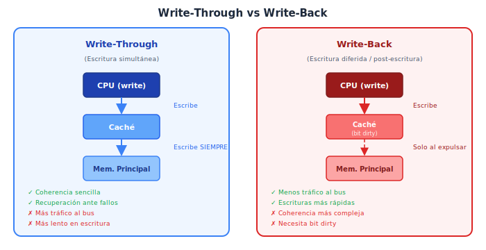

*Figura 5.7. Comparación de las políticas write-through y write-back. En write-through, cada escritura llega a memoria principal. En write-back, las escrituras se acumulan en caché y solo se escriben a memoria al expulsar el bloque.*

#### Write-through (escritura simultánea)

Cada escritura en caché se propaga **inmediatamente** a memoria principal.

- **Ventajas:** la memoria principal siempre contiene el valor actualizado, lo que simplifica la coherencia en sistemas con múltiples procesadores y facilita la recuperación ante fallos.
- **Desventajas:** genera mucho tráfico hacia memoria principal. Para mitigarlo, se usa un **write buffer** (búfer de escritura) que acumula temporalmente las escrituras pendientes.

#### Write-back (post-escritura / escritura diferida)

Las escrituras se realizan solo en la caché. El bloque modificado se marca con un **bit dirty**. Solo cuando ese bloque es expulsado de la caché se escribe en memoria principal.

- **Ventajas:** menos tráfico a memoria; múltiples escrituras al mismo bloque solo generan una escritura a memoria al expulsar.
- **Desventajas:** la memoria principal puede tener datos desactualizados, lo que complica la coherencia en multiprocesadores.

**Tabla comparativa:**

| Aspecto | Write-Through | Write-Back |
|:---|:---|:---|
| Tráfico a memoria | Alto (cada escritura) | Bajo (solo al expulsar) |
| Coherencia | Sencilla | Más compleja |
| Necesita bit dirty | No | Sí |
| Necesita write buffer | Generalmente sí | No necesariamente |
| Recuperación ante fallos | Más robusta | Riesgo de perder datos |
| Uso dominante hoy | L1 en algunos diseños | L2, L3 y mayoría de L1 modernos |

#### Miss de escritura

Cuando se escribe un dato que no está en caché:
- **Write-allocate:** se trae el bloque a caché y luego se escribe en él (habitual con write-back).
- **No-write-allocate (write-around):** se escribe directamente en memoria sin traer el bloque a caché (habitual con write-through).

### 5.3.7. Cachés multinivel

Los diseños modernos usan **cachés multinivel** (L1, L2, L3) para tratar de cubrir la brecha entre la velocidad del procesador y la latencia de la DRAM.

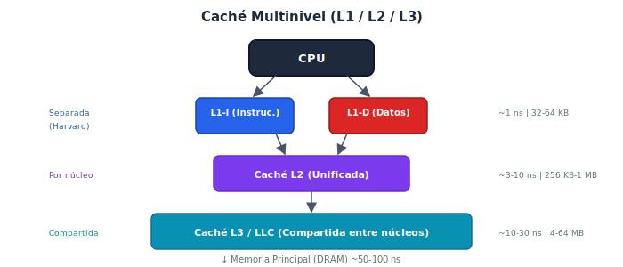

*Figura 5.8. Organización típica de caché multinivel. L1 se divide en caché de instrucciones (L1-I) y caché de datos (L1-D). L2 es unificada y privada por núcleo. L3 es compartida entre todos los núcleos.*

**Principios de diseño:**
- **L1:** muy pequeña (32-64 KB) y muy rápida (1-3 ciclos). Se optimiza para **tiempo de acierto bajo**. Suele ser separada (instrucciones y datos) para permitir acceso simultáneo.
- **L2:** más grande (256 KB-1 MB), algo más lenta (3-10 ciclos). Se optimiza para **reducir la tasa de fallos de L1**.
- **L3 / LLC:** mucho más grande (4-64 MB), latencia de 10-30 ciclos. Compartida entre núcleos; funciona como último recurso antes de ir a DRAM.

**TMA con múltiples niveles:**

Para un sistema con dos niveles de caché:

$$TMA = t_{a,L1} + m_{L1} \times (t_{a,L2} + m_{L2} \times p_{f,L2})$$

Es decir: cada acceso cuesta el tiempo de acierto de L1, más la fracción de fallos de L1 que debe resolverse en L2, más la fracción de esos que falla en L2 y va a memoria.

> **Importante**
> En un sistema multinivel hay dos formas de expresar la tasa de fallos de L2:
> - **Local miss rate:** fallos de L2 dividido por accesos a L2 (= fallos de L1).
> - **Global miss rate:** fallos de L2 dividido por accesos totales a memoria.
>
> La global miss rate es la que importa para calcular el TMA del sistema completo: $m_{global,L2} = m_{L1} \times m_{local,L2}$.

### 5.3.8. Rendimiento cuantitativo de la caché

#### Tiempo de CPU y stalls de memoria

El tiempo total de CPU para ejecutar un programa es:

$$T_{CPU} = (Ciclos_{CPU} + Ciclos_{stall\_memoria}) \times T_{ciclo}$$

donde los stalls de memoria son los ciclos en los que el procesador queda bloqueado esperando datos. Se pueden calcular como:

$$Ciclos_{stall\_memoria} = N_{accesos\_memoria} \times m \times p_f$$

O, expresado por instrucción:

$$CPI_{total} = CPI_{ideal} + \frac{N_{accesos\_memoria}}{N_{instrucciones}} \times m \times p_f$$

$$CPI_{total} = CPI_{ideal} + CPI_{memoria}$$

**Variables:**
- $CPI_{ideal}$: ciclos por instrucción sin considerar la memoria (solo ejecución).
- $N_{accesos\_memoria} / N_{instrucciones}$: número medio de accesos a memoria por instrucción (típicamente 1 para instrucciones + 0,3-0,5 para datos en un programa medio, es decir, alrededor de 1,3-1,5).
- $m$: tasa de fallos de la caché.
- $p_f$: penalización de fallo en ciclos.

> **Ejemplo numérico completo**
> Datos:
> - $CPI_{ideal} = 1$
> - Tasa de fallos: $m = 2\%$
> - Penalización de fallo: $p_f = 100$ ciclos
> - Accesos a memoria por instrucción: 1,3
>
> Cálculo:
>
> $CPI_{memoria} = 1{,}3 \times 0{,}02 \times 100 = 2{,}6$ ciclos
>
> $CPI_{total} = 1 + 2{,}6 = 3{,}6$ ciclos
>
> **Interpretación:** la memoria más que triplica el CPI. Un 2% de fallos, que parece pequeño, provoca que los stalls de memoria dominen el rendimiento. Esto demuestra la importancia crítica de optimizar la jerarquía de memoria.

#### Efecto de cada parámetro en el rendimiento

| Parámetro | Efecto al aumentarlo | Efecto al reducirlo |
|:---|:---|:---|
| Tasa de fallos ($m$) | Más stalls, más lento | Menos stalls, más rápido |
| Penalización de fallo ($p_f$) | Cada fallo es más costoso | Cada fallo es menos costoso |
| Tiempo de acierto ($t_a$) | Todo acceso es más lento, incluso los hits | Acceso base más rápido |
| Tamaño de caché (↑) | Reduce $m$ (menos fallos de capacidad) | — |
| Asociatividad (↑) | Reduce $m$ (menos fallos de conflicto) | — |
| Tamaño de bloque (↑) | Reduce fallos forzosos, pero puede aumentar $p_f$ | — |

### 5.3.9. Tipos de fallos: la taxonomía de las tres C

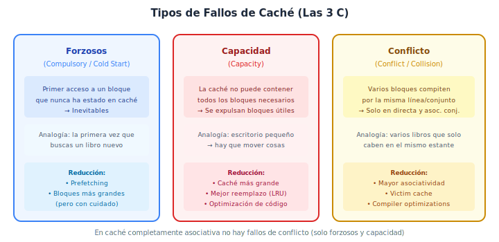

*Figura 5.9. Las tres C: fallos forzosos (cold start), de capacidad y de conflicto. Cada tipo tiene causas y soluciones distintas.*

| Tipo | Causa | Se eliminaría si… | Cómo reducirlo |
|:---|:---|:---|:---|
| **Forzoso** (Compulsory) | Primer acceso a un bloque | Se pudiera precargar todo | Prefetching, bloques más grandes |
| **Capacidad** (Capacity) | La caché no puede contener todos los bloques activos | La caché fuera infinita | Caché más grande |
| **Conflicto** (Conflict) | Varios bloques compiten por la misma línea/conjunto | La caché fuera completamente asociativa | Mayor asociatividad, victim cache |

> **Advertencia**
> Aumentar el tamaño de bloque reduce los fallos forzosos pero puede aumentar los fallos de capacidad (caben menos bloques en la caché) y la penalización de fallo (se tarda más en transferir un bloque grande). El diseño es siempre un equilibrio.

### 5.3.10. Técnicas de optimización

Existen múltiples técnicas para mejorar el rendimiento de la caché, organizadas según qué métrica mejoran:

**1. Reducir la tasa de fallos:**
- Aumentar el tamaño de la caché.
- Aumentar la asociatividad.
- Usar victim cache (pequeña caché completamente asociativa que almacena los bloques expulsados recientemente).
- Optimización de compilador: reordenar bucles para mejorar la localidad (blocking / tiling).

**2. Reducir la penalización de fallo:**
- Cachés multinivel.
- Priorizar la palabra solicitada (critical word first / early restart).
- Merging write buffers.
- Prefetching por hardware o software.

**3. Reducir el tiempo de acierto:**
- Cachés pequeñas y simples.
- Cachés con pipeline.
- Cachés de camino predicho (way prediction).

> **Mini conclusión**: la caché es el elemento más crítico de la jerarquía de memoria. Su diseño —organización, tamaño, asociatividad, política de escritura y reemplazo— determina en gran medida el rendimiento global del sistema. Las métricas TMA, CPI de memoria y TCPU permiten evaluar cuantitativamente las decisiones de diseño.

---

## 5.4. Mejoras del rendimiento de la memoria principal

La memoria principal (DRAM) es el cuello de botella cuando la caché falla. Esta sección estudia las técnicas para mejorar el rendimiento de la DRAM.

### 5.4.1. Latencia frente a ancho de banda

Conviene distinguir dos métricas de rendimiento de la memoria:

- **Latencia:** tiempo que tarda en servirse un único acceso. Depende del tiempo de acceso al array DRAM y del tiempo de transferencia por el bus.
- **Ancho de banda (bandwidth):** cantidad de datos que pueden transferirse por unidad de tiempo. Depende del ancho del bus y de su velocidad.

La latencia de la DRAM mejora muy lentamente (pocos % al año). El ancho de banda mejora algo más rápido gracias a buses más anchos y protocolos más eficientes (DDR, DDR2, …, DDR5). La mayoría de las técnicas de esta sección mejoran principalmente el **ancho de banda**, lo cual ayuda a reducir la penalización de fallo cuando se transfieren bloques completos.

> **Analogía cotidiana**: la latencia es como el tiempo que tarda en abrirse la puerta del almacén. El ancho de banda es como el ancho de la puerta: una puerta más ancha permite pasar más cosas a la vez, pero no se abre más rápido.

En términos de arquitectura de computadores, esto significa que las técnicas de mejora de la DRAM se centran más en mover muchos datos por unidad de tiempo que en reducir el tiempo individual de acceso.

### 5.4.2. Memoria más ancha (wider memory)

La idea más directa es **aumentar el ancho del bus de memoria**: en lugar de transferir una palabra por ciclo, transferir varias en paralelo.

- **Ejemplo:** si la caché tiene bloques de 64 bytes y el bus transfiere 8 bytes por ciclo, se necesitan 8 ciclos de transferencia. Si se duplica el ancho del bus a 16 bytes, se necesitan solo 4 ciclos.
- **Ventaja:** reduce directamente el tiempo de transferencia y, con ello, la penalización de fallo.
- **Desventaja:** requiere un bus más ancho (más pines, mayor coste, más consumo).

### 5.4.3. Memoria entrelazada (interleaved memory)

La **memoria entrelazada** distribuye las direcciones consecutivas entre varios **bancos de memoria** independientes, de modo que mientras un banco está completando un acceso, otro banco puede comenzar a atender el siguiente acceso.

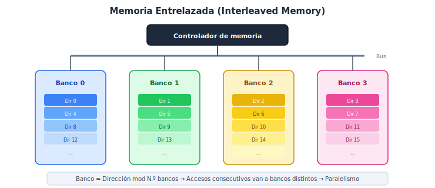

*Figura 5.10. Memoria entrelazada con 4 bancos. Las direcciones consecutivas se distribuyen cíclicamente entre bancos: dir. 0 → Banco 0, dir. 1 → Banco 1, dir. 2 → Banco 2, dir. 3 → Banco 3, dir. 4 → Banco 0, etc.*

$$\text{Banco} = \text{dirección} \mod N_{\text{bancos}}$$

**Funcionamiento solapado:** cuando se solicitan varias palabras consecutivas (por ejemplo, al rellenar un bloque de caché), cada una va a un banco distinto. El primer acceso sufre la latencia completa, pero los siguientes bancos ya están preparando su dato en paralelo, y pueden entregar su resultado en ciclos sucesivos.

**Reducción de la penalización de fallo:** con n bancos, la penalización para transferir un bloque completo se reduce significativamente porque las latencias de acceso a los distintos bancos se solapan.

> **Analogía cotidiana**: imagina una oficina de atención al público con 4 ventanillas. Si cada ventanilla tarda 4 minutos en atender, pero las colas se reparten de forma que tú vas a una ventanilla diferente cada vez, el tiempo medio de espera baja mucho porque todas trabajan en paralelo.

Técnicamente, la analogía corresponde a que cada banco opera de forma independiente y puede estar en una fase distinta de su ciclo de acceso, permitiendo solapamiento.

### 5.4.4. Bancos de memoria independientes

Los bancos de memoria independientes son una generalización: en lugar de direcciones entrelazadas fijas, los bancos pueden servir peticiones no consecutivas de forma independiente. Esto es especialmente útil en sistemas multiprocesador, donde distintos procesadores pueden acceder a bancos distintos simultáneamente.

### 5.4.5. Conflictos entre bancos

Los conflictos entre bancos (bank conflicts) se producen cuando dos o más accesos consecutivos van al mismo banco. Esto puede ocurrir con patrones de acceso no secuenciales (por ejemplo, al acceder a una columna de una matriz almacenada por filas).

**Soluciones:**
- **Hardware:** aumentar el número de bancos; usar esquemas de asignación de direcciones que reduzcan conflictos.
- **Software:** optimización de compilador para reorganizar los accesos a memoria y evitar patrones conflictivos (padding, loop transformations).

**Tabla comparativa:**

| Técnica | Cómo mejora | Principal ventaja | Principal limitación |
|:---|:---|:---|:---|
| Memoria más ancha | Más datos por ciclo de bus | Reducción directa de penalización de fallo | Más pines, mayor coste del bus |
| Memoria entrelazada | Solapamiento de accesos a bancos | Reduce penalización para bloques | Conflictos si accesos van al mismo banco |
| Bancos independientes | Accesos concurrentes de distintos peticionarios | Escalabilidad en multiprocesadores | Conflictos si se concentran en un banco |

> **Mini conclusión**: las mejoras de la memoria principal se centran en aumentar el ancho de banda efectivo, ya que la latencia de la DRAM es difícil de reducir. La memoria entrelazada y los bancos independientes permiten solapar accesos y atender transferencias de bloques en menos ciclos, reduciendo la penalización de fallo.

---

## 5.5. Memoria virtual

### 5.5.1. Conceptos generales

La **memoria virtual** es un mecanismo que proporciona a cada proceso la ilusión de disponer de un espacio de direcciones propio, grande y contiguo, independientemente de la cantidad real de memoria física (RAM) disponible. La memoria virtual:

- **Separa** el espacio de direcciones del programa (direcciones virtuales) del espacio de direcciones físicas de la RAM.
- **Permite** ejecutar programas más grandes que la RAM disponible, porque solo las partes activamente usadas del programa necesitan estar en memoria física; el resto reside en disco (swap).
- **Garantiza** protección entre procesos: cada proceso solo puede acceder a su propio espacio de direcciones.
- **Facilita** la reubicación: el enlazador y el cargador pueden colocar el programa en cualquier zona de la memoria física.

> **Analogía cotidiana**: la memoria virtual es como un sistema de reservas de un hotel. Cada huésped (proceso) cree que tiene una habitación (espacio de direcciones) permanentemente asignada con un número fijo. Pero el hotel (sistema operativo) puede mover internamente a los huéspedes entre habitaciones físicas, ampliar la capacidad usando otro edificio (disco) o incluso alojar a huéspedes que todavía no han llegado, sin que el huésped lo note.

En términos de arquitectura de computadores, esto significa que la dirección que usa el programa (dirección virtual) no coincide necesariamente con la dirección real de la RAM donde está almacenado el dato (dirección física). Un mecanismo de traducción convierte unas en otras de forma transparente al programa.

### 5.5.2. Direcciones virtuales y físicas

| Concepto | Definición |
|:---|:---|
| **Dirección virtual** | Dirección generada por el programa / procesador. Cada proceso tiene su propio espacio virtual. |
| **Dirección física** | Dirección real de la RAM. Es la que se usa finalmente para acceder al hardware de memoria. |
| **Espacio virtual** | Rango completo de direcciones virtuales posibles (p. ej., 0 a $2^{48}-1$ en un sistema de 48 bits). |
| **Espacio físico** | Rango de direcciones que corresponden a RAM real instalada. Suele ser menor que el virtual. |

### 5.5.3. Paginación

El esquema de memoria virtual más habitual es la **paginación**:

- El espacio virtual se divide en bloques de tamaño fijo llamados **páginas** (tamaño típico: 4 KB, 2 MB o 1 GB).
- El espacio físico se divide en bloques del mismo tamaño llamados **marcos de página (frames)**.
- El SO mantiene una **tabla de páginas** que mapea cada página virtual a un marco de página física (o indica que la página está en disco).

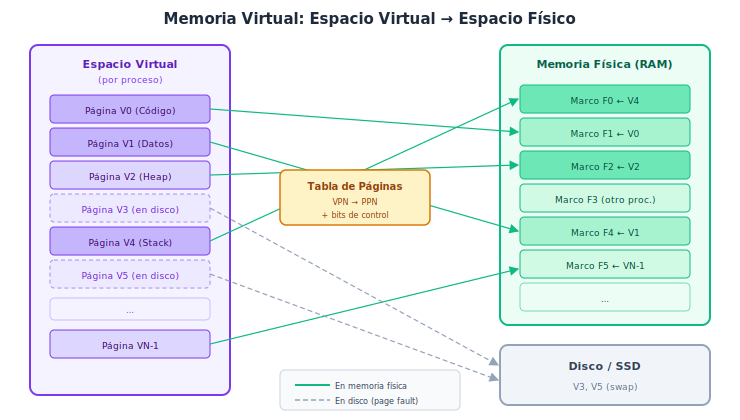

*Figura 5.11. Mapeo de páginas virtuales a marcos de página físicos. Algunas páginas virtuales no tienen marco asignado y residen en disco (swap). El acceso a ellas provoca un fallo de página.*

### 5.5.4. Fallos de página

Un **fallo de página (page fault)** ocurre cuando el procesador intenta acceder a una página virtual que no tiene un marco de página física asignado (normalmente porque la página está en disco).

El tratamiento de un fallo de página es radicalmente más costoso que un fallo de caché:

| Tipo de fallo | Penalización típica | Factor de diferencia |
|:---|:---|:---|
| Fallo de caché L1 | ~10-100 ciclos | 1× |
| Fallo de caché L2 | ~100-300 ciclos | ~10× |
| Fallo de página (SSD) | ~10⁵ ciclos | ~1.000× |
| Fallo de página (HDD) | ~10⁷ ciclos | ~100.000× |

Por ello, el sistema de memoria virtual se diseña para **minimizar los fallos de página**:
- Se usan páginas relativamente grandes (4 KB o más) para aprovechar la localidad espacial.
- La ubicación es **completamente asociativa**: una página virtual puede ir a cualquier marco, para evitar conflictos.
- El reemplazo usa algoritmos sofisticados (aproximaciones a LRU) porque el coste de un mal reemplazo es enorme.
- Se usa siempre **write-back** para las páginas modificadas, para evitar escrituras innecesarias a disco.

### 5.5.5. Traducción de direcciones y TLB

La traducción de dirección virtual a física debe hacerse en **cada acceso a memoria**, lo que exige que sea extremadamente rápida.

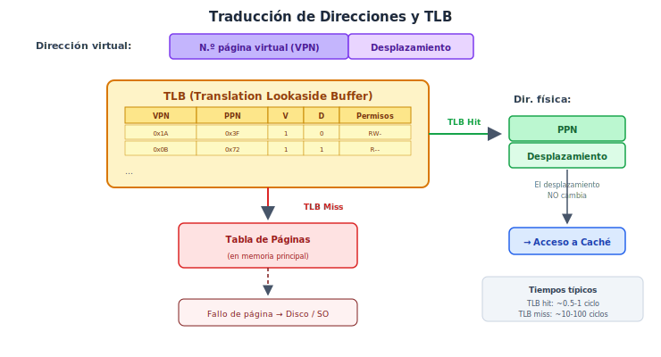

*Figura 5.12. Esquema de traducción de direcciones con TLB. El TLB es una caché de traducciones recientes. Si la traducción está en el TLB (TLB hit), se obtiene el PPN directamente. Si no (TLB miss), hay que consultar la tabla de páginas en memoria.*

La dirección virtual se descompone en:
- **Número de página virtual (VPN):** identifica la página.
- **Desplazamiento dentro de la página (offset):** se mantiene igual en la dirección física, porque las páginas están alineadas.

El **TLB (Translation Lookaside Buffer)** es una caché pequeña y rápida que almacena las traducciones más recientes (pares VPN → PPN). Es típicamente completamente asociativo o de alta asociatividad, con 32-1024 entradas.

**Flujo de traducción:**
1. El procesador genera una dirección virtual (VPN + offset).
2. El VPN se busca en el TLB.
3. Si hay **TLB hit** (~0,5-1 ciclo): se obtiene inmediatamente el PPN (Physical Page Number) y se construye la dirección física (PPN + offset).
4. Si hay **TLB miss** (~10-100 ciclos): se consulta la tabla de páginas en memoria principal para obtener el PPN, se actualiza el TLB y se reintenta.
5. Si la tabla de páginas indica que la página no está en RAM → **fallo de página** → el SO interviene, trae la página del disco a un marco libre, actualiza la tabla y reinicia la instrucción.

> **Nota**
> El TLB miss es un problema de rendimiento serio porque cada miss implica uno o varios accesos a memoria principal solo para la traducción (page table walk). Por eso, los TLBs modernos suelen ser multinivel (L1-TLB de ~64 entradas, L2-TLB de ~1024 entradas).

### 5.5.6. Papel del sistema operativo

El sistema operativo es responsable de:
- **Gestionar la tabla de páginas** de cada proceso.
- **Manejar los fallos de página:** decidir qué página expulsar, traer la página del disco, actualizar la tabla.
- **Garantizar la protección:** verificar los bits de permisos (lectura, escritura, ejecución) en cada traducción.
- **Facilitar la multiprogramación:** cambiar de contexto entre procesos implica cambiar la tabla de páginas activa (o invalidar el TLB).

### 5.5.7. Protección, reubicación, multiprogramación y compartición

La memoria virtual proporciona cuatro servicios fundamentales al sistema operativo:

| Servicio | Cómo lo logra la memoria virtual |
|:---|:---|
| **Protección** | Cada proceso tiene su propia tabla de páginas; no puede acceder a marcos de otro proceso sin permiso explícito. Bits de permisos (R/W/X) en cada entrada. |
| **Reubicación** | El programa usa direcciones virtuales fijas; el SO puede colocar las páginas en cualquier marco físico disponible. |
| **Multiprogramación** | Varios procesos coexisten en RAM, cada uno con su propio espacio virtual aislado. |
| **Compartición** | Dos procesos pueden mapear la misma página física en sus respectivos espacios virtuales (bibliotecas compartidas, memoria compartida). |

### 5.5.8. Relación entre memoria virtual y jerarquía de memoria

La memoria virtual añade un nivel más (disco/SSD) a la jerarquía de memoria. Los principios son los mismos que en la caché:

| Concepto en caché | Equivalente en memoria virtual |
|:---|:---|
| Bloque | Página |
| Línea / entrada | Marco de página |
| Fallo de caché | Fallo de página |
| Reemplazo (LRU, etc.) | Reemplazo de página |
| Write-back | Write-back a disco |
| Completamente asociativa | Ubicación libre de páginas |
| TMA | Incluye penalización de page fault |

> **Importante**
> La enorme penalización de un fallo de página (millones de ciclos) hace que la tasa de fallos de página deba ser extremadamente baja (del orden de $10^{-6}$ o menos). Esto justifica el uso de ubicación completamente asociativa, reemplazo LRU sofisticado y páginas grandes.

> **Mini conclusión**: la memoria virtual desacopla la visión del programa (espacio virtual grande, limpio y protegido) de la realidad física (RAM limitada). El TLB es crítico para que la traducción no se convierta en un cuello de botella. La enorme penalización de los fallos de página obliga a diseñar el sistema para que sean extremadamente infrecuentes.

---

## 5.6. Jerarquía de memoria en arquitecturas actuales

Esta sección actualiza los conceptos clásicos del tema con información vigente y contrastada sobre tres familias arquitectónicas contemporáneas: **Apple Silicon**, **ARM (Cortex)** y **RISC-V**. Se distingue explícitamente entre **ISA** (arquitectura del conjunto de instrucciones) y **microarquitectura** (implementación concreta del hardware), y entre datos **documentados oficialmente**, **inferidos razonablemente** y **no confirmados con suficiente precisión**.

### 5.6.1. ISA frente a microarquitectura

Antes de analizar las plataformas modernas, es esencial aclarar esta distinción:

| Concepto | Definición | Ejemplos |
|:---|:---|:---|
| **ISA** | Especificación abstracta del repertorio de instrucciones, modelo de memoria, registros, modos de direccionamiento y modelo de privilegios. Es lo que ve el programador o compilador. | ARMv9, RISC-V RV64GC |
| **Microarquitectura** | Implementación concreta en hardware de una ISA: tamaño y organización de cachés, pipeline, branch predictor, número de unidades funcionales, etc. | Apple M4, Arm Cortex-X4, SiFive P870 |

**Implicación clave:** la caché L1, L2 o L3, su tamaño, asociatividad y política de reemplazo son decisiones de **microarquitectura**, no de la ISA. Dos chips que implementan la misma ISA pueden tener jerarquías de memoria completamente distintas.

Sin embargo, la ISA sí define aspectos que afectan a la jerarquía de memoria:
- Modelo de memoria (ordenación de accesos a memoria, reglas de coherencia).
- Instrucciones de prefetch y barreras de memoria.
- Esquema de paginación (tamaños de página soportados, niveles de tabla de páginas).
- Instrucciones de gestión de caché y TLB (invalidación, limpieza).

### 5.6.2. Apple Silicon

> **Nivel de documentación:** Apple publica información limitada pero significativa a través de Apple Developer, WWDC y documentación de optimización para desarrolladores. Muchos detalles de la microarquitectura provienen de análisis de terceros de alta fiabilidad (Anandtech, Chips and Cheese) y de las especificaciones publicadas por Apple en sus fichas de producto.

**ISA:** ARMv8.5-A / ARMv8.6-A (M1/M2) y ARMv9.2-A (M3/M4). Apple licencia el conjunto de instrucciones ARM pero diseña su propia microarquitectura.

**Jerarquía de caché (ejemplo M3/M4, datos documentados e inferidos):**

| Nivel | Tamaño (P-core) | Tamaño (E-core) | Asociatividad | Notas |
|:---|:---|:---|:---|:---|
| L1-I | 192 KB | 128 KB | 6 vías | Muy grande para L1; prioriza ancho de decodificación |
| L1-D | 128 KB | 64 KB | 8 vías | Optimizada para latencia baja |
| L2 | 16-32 MB (compartida por clúster) | 4 MB | — | Compartida entre P-cores o E-cores del clúster |
| SLC (System Level Cache) | 16-48 MB | — | — | Último nivel antes de DRAM; compartida por CPU, GPU, NPU |

**Memoria Unificada (UMA):**

Apple Silicon integra CPU, GPU, Neural Engine y otros aceleradores en un **System on Chip (SoC)** con un subsistema de memoria unificado:

- La **memoria LPDDR4X / LPDDR5** es compartida por todos los bloques (**no** hay VRAM separada para la GPU).
- Los distintos bloques acceden al mismo espacio de direcciones físicas.
- Esto elimina las copias CPU↔GPU típicas de los sistemas discretos, lo que mejora latencia y eficiencia energética.
- El **SLC (System Level Cache)** actúa como último nivel de caché compartido antes de la DRAM.

**Ventajas:** baja latencia entre CPU y GPU, menor consumo, gran eficiencia en tareas que mezclan cómputo y gráficos.

**Limitaciones:** la RAM es fija (soldada al sustrato); no es ampliable. El ancho de banda es compartido entre todos los bloques, por lo que cargas de trabajo intensivas en GPU pueden competir con la CPU.

*Fuente: Apple Developer documentation, WWDC sessions, fichas técnicas oficiales Apple.*

### 5.6.3. ARM (Cortex)

> **Nivel de documentación:** ARM (Arm Holdings) publica extensamente la especificación de la ISA (ARM Architecture Reference Manual, ARM ARM) y los TRM (Technical Reference Manual) de cada microarquitectura de referencia Cortex. La documentación es accesible en developer.arm.com.

**ISA:** ARMv8-A / ARMv9-A. Define modelos de memoria (regulados por el *ARM Memory Model*), instrucciones de barrier (DMB, DSB, ISB), soporte para paginación con granulados de 4 KB, 16 KB y 64 KB, y extensiones como MTE (Memory Tagging Extension).

**Microarquitectura Cortex (diseños de referencia de Arm):**

Arm proporciona diseños de referencia que los fabricantes (Qualcomm, MediaTek, Samsung, etc.) pueden licenciar e integrar en sus SoCs. Los más relevantes actualmente son:

| Núcleo | Tipo | L1-I | L1-D | L2 (por core) | L3 (compartida) |
|:---|:---|:---|:---|:---|:---|
| Cortex-X4 | Performance (big) | 64 KB | 64 KB | 1 MB | 4-12 MB (configurable) |
| Cortex-A720 | Balanced (mid) | 64 KB | 64 KB | 256-512 KB | Compartida con X4 |
| Cortex-A520 | Efficiency (LITTLE) | 32 KB | 32 KB | 128-256 KB | Compartida |

**DynamIQ / big.LITTLE:**

ARM utiliza una arquitectura heterogénea donde núcleos grandes (rendimiento máximo) y pequeños (eficiencia) **comparten el mismo subsistema de memoria** (L3, DRAM):

- El **clúster de caché L3** es compartido y actúa como punto de coherencia.
- La coherencia entre núcleos se gestiona por hardware mediante protocolos MOESI/MESI, implementados en la DSU (DynamIQ Shared Unit).

**TLB:** las implementaciones Cortex incluyen TLBs multinivel (L1-DTLB de ~48 entradas, L1-ITLB de ~48 entradas, L2-TLB unificado de ~1024-2048 entradas). El tamaño exacto es configurable por el integrador del SoC.

*Fuente: Arm Architecture Reference Manual, Cortex-X4 TRM, Arm Developer documentation.*

### 5.6.4. RISC-V

> **Nivel de documentación:** RISC-V es una ISA abierta. Las especificaciones privileged y unprivileged están disponibles públicamente en riscv.org. La ISA define el modelo de memoria y el esquema de paginación, pero **no prescribe** la organización de la caché, que es decisión de cada implementador.

**ISA:** RISC-V (RV64GC con extensiones opcionales). Características relevantes para la jerarquía de memoria:

- **Modelo de memoria RVWMO (RISC-V Weak Memory Ordering):** modelo de consistencia débil que permite reordenaciones de accesos para mejorar el rendimiento. Requiere instrucciones FENCE explícitas para forzar ordenación cuando sea necesario.
- **Paginación Sv39 / Sv48 / Sv57:** esquemas de paginación con 3, 4 o 5 niveles de tabla de páginas, con páginas base de 4 KB y soporte para superpáginas (megapáginas de 2 MB, gigapáginas de 1 GB).
- **Instrucciones FENCE.I, SFENCE.VMA:** para sincronización de caché de instrucciones y para invalidar TLB.

**Microarquitecturas RISC-V actuales:**

| Implementación | Fabricante | L1 | L2 | Notas |
|:---|:---|:---|:---|:---|
| SiFive P870 | SiFive | 32 KB I + 32 KB D | 256 KB-2 MB | Alto rendimiento; comparable a Cortex-A7x |
| C910 | T-Head (Alibaba) | 64 KB I + 64 KB D | 1 MB (compartida) | Linux-capable, OoO |
| Veyron V1 | Ventana Micro | 32 KB I + 32 KB D | 2 MB | Orientado a datacenter |

**Ecosistema abierto vs propietario:** la principal ventaja de RISC-V es que no requiere licencia para implementar la ISA, permitiendo que cualquier empresa u organización diseñe su propia microarquitectura. Esto conlleva mayor diversidad pero también mayor fragmentación del ecosistema.

*Fuente: The RISC-V Instruction Set Manual, Volume II: Privileged Architecture (riscv.org); SiFive product briefs.*

### 5.6.5. Comparación entre plataformas

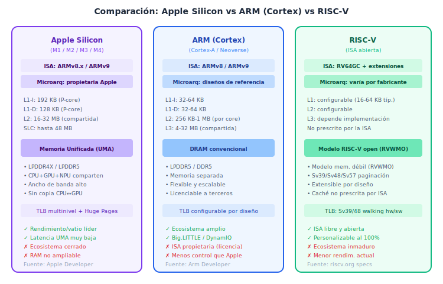

*Figura 5.13. Comparación de Apple Silicon, ARM Cortex y RISC-V en aspectos de jerarquía de memoria.*

**Tabla comparativa detallada:**

| Aspecto | Apple Silicon | ARM (Cortex ref.) | RISC-V |
|:---|:---|:---|:---|
| **ISA** | ARMv8/v9 (licencia) | ARMv8/v9 (propia) | RISC-V (abierta) |
| **Microarquitectura** | Propietaria Apple | Diseños de referencia Arm | Varía por fabricante |
| **L1 típica** | 128-192 KB (muy grande) | 32-64 KB | 16-64 KB |
| **L2 típica** | 16-32 MB (compartida) | 256 KB-1 MB (por core) | 256 KB-2 MB |
| **L3 / LLC** | SLC 16-48 MB | 4-12 MB (DSU) | Depende de implementación |
| **Modelo de memoria** | ARM memory model | ARM memory model | RVWMO (débil) |
| **Paginación** | 4 KB / 16 KB | 4 KB / 16 KB / 64 KB | Sv39/48/57 (4 KB) |
| **Memoria unificada** | Sí (UMA) | No (DRAM convencional) | No (convencional) |
| **Coherencia** | Hardware (propietaria) | MOESI/MESI (DSU) | Definida por implementador |
| **Prefetching** | HW agresivo (documentado por Apple) | HW en Cortex (configurable) | Depende de implementación |
| **Ecosistema** | Cerrado (solo Apple) | Semi-abierto (licencia) | Abierto (libre) |
| **Madurez** | Producción masiva (2020+) | Producción masiva (2011+) | Emergente (producción limitada) |

### 5.6.6. Coherencia y consistencia de memoria

**Coherencia de caché:** en sistemas con múltiples núcleos que comparten memoria, todos los núcleos deben ver un mismo valor para cada dirección de memoria. Los protocolos de coherencia (MESI, MOESI) garantizan esto mediante:
- Invalidación: cuando un núcleo modifica un dato, los demás núcleos invalidan su copia.
- Actualización: cuando un núcleo modifica un dato, los demás núcleos reciben la actualización.

**Consistencia de memoria:** define el **orden** en que los accesos a memoria de distintos núcleos son visibles entre sí. Los modelos van desde **secuencialmente consistente** (más restrictivo, más intuitivo, menor rendimiento) hasta **relajados** (permiten reordenar accesos, mayor rendimiento, requieren barreras explícitas).

- **ARM** usa un modelo relajado pero bien definido, con barreras DMB/DSB/ISB.
- **RISC-V** usa RVWMO, también relajado, con FENCE.
- **Apple Silicon** implementa el modelo ARM, pero con optimizaciones microarquitectónicas agresivas. Soporta además TSO (Total Store Ordering) para compatibilidad con código x86 emulado por Rosetta 2 (*documentado oficialmente por Apple*).

### 5.6.7. Prefetching

El **prefetching** trae datos a caché antes de que el procesador los solicite, anticipando patrones de acceso. Puede ser:
- **Por hardware:** el controlador de caché detecta patrones de stride (acceso con paso regular) y precarga los bloques siguientes.
- **Por software:** el compilador o el programador insertan instrucciones de prefetch.

> **Nota sobre documentación:**
> - Apple ha documentado oficialmente que sus procesadores incluyen prefetchers de hardware agresivos y recomienda patrones de acceso amigables con prefetching (Apple Optimization Guide).
> - ARM documenta prefetching de hardware configurable en sus TRMs de Cortex.
> - RISC-V no incluye instrucciones de prefetch en la ISA base, pero la extensión Zicbop (Cache-Block Operation Prefetch) está ratificada.

### 5.6.8. Qué del enfoque clásico sigue siendo válido

| Concepto clásico | Vigencia actual |
|:---|:---|
| Principio de localidad | **Plenamente vigente.** Sigue siendo el fundamento de toda la jerarquía. |
| Jerarquía piramidal | **Vigente**, enriquecida con SLC, DRAM unificada y memorias on-package. |
| Cachés asociativas por conjuntos | **Dominante** en L1/L2/L3 de todas las plataformas. |
| Write-back | **Prácticamente universal** en cachés L1 modernas de alto rendimiento. |
| TLB y paginación | **Plenamente vigente**, extendido a TLBs multinivel y huge pages. |
| Fórmula del TMA | **Válida conceptualmente**; en la práctica, los procesadores OoO ocultan parte de la penalización mediante ejecución especulativa. |
| Las tres C | **Válida para clasificar fallos**; la cuarta C (coherence) se añade en multiprocesadores. |

> **Advertencia**
> El modelo clásico de stalls de memoria (CPI = CPI_ideal + CPI_memoria) supone que el procesador se detiene completamente en cada fallo. En procesadores modernos con ejecución fuera de orden, parte de la penalización se oculta ejecutando otras instrucciones. Por tanto, el TMA y el CPI_memoria clásicos son cotas superiores; el rendimiento real suele ser algo mejor.

> **Mini conclusión**: las arquitecturas modernas materializan los mismos principios de la jerarquía de memoria clásica, pero con implementaciones sofisticadas. Apple Silicon destaca por su memoria unificada y cachés agresivamente grandes. ARM proporciona diseños de referencia flexibles y ampliamente adoptados. RISC-V ofrece libertad total de diseño pero con un ecosistema todavía en maduración. La distinción ISA vs microarquitectura es imprescindible para entender por qué chips con la misma ISA pueden tener rendimientos de memoria muy diferentes.

---

## Ejercicios resueltos

### Nivel 1. Comprensión básica

---

#### Ejercicio 1.1. Hit y miss en una secuencia simple

**Enunciado:** un procesador con una caché inicialmente vacía de correspondencia directa con 4 líneas y bloques de 1 palabra accede secuencialmente a las direcciones de bloque: 0, 2, 4, 0, 6, 2.

**Qué se pide:** determinar para cada acceso si es hit o miss, e identificar el tipo de localidad involucrado.

**Datos disponibles:**
- Caché de correspondencia directa, 4 líneas (líneas 0, 1, 2, 3).
- Caché inicialmente vacía.
- Secuencia de accesos: 0, 2, 4, 0, 6, 2.

**Conceptos implicados:** correspondencia directa, acierto, fallo, localidad temporal.

**Resolución paso a paso:**

La línea se calcula como: línea = dirección mod 4.

| Acceso | Dir. bloque | Línea = dir mod 4 | ¿Contenido previo? | Resultado | Tipo de fallo |
|:---|:---|:---|:---|:---|:---|
| 1 | 0 | 0 | (vacía) | **MISS** | Forzoso (cold start) |
| 2 | 2 | 2 | (vacía) | **MISS** | Forzoso |
| 3 | 4 | 0 | Bloque 0 | **MISS** | Conflicto (4 y 0 compiten por línea 0) |
| 4 | 0 | 0 | Bloque 4 | **MISS** | Conflicto (0 y 4 compiten por línea 0) |
| 5 | 6 | 2 | Bloque 2 | **MISS** | Conflicto (6 y 2 compiten por línea 2) |
| 6 | 2 | 2 | Bloque 6 | **MISS** | Conflicto |

**Resultado final:** 0 aciertos, 6 fallos. Tasa de aciertos = 0%. Tasa de fallos = 100%.

**Interpretación:** este es un caso patológico donde dos pares de bloques (0,4 y 2,6) compiten constantemente por las mismas líneas, provocando un fenómeno conocido como *thrashing*. A pesar de que se reaccede a bloques (localidad temporal potencial), los conflictos impiden aprovecharla.

**Error típico:** pensar que "si solo fallo un 2%, no importa". En este ejemplo se ve que un patrón de acceso desafortunado puede anular completamente la caché.

**Mini variante:** ¿qué pasaría con una caché asociativa por conjuntos de 2 vías (2 conjuntos)? El acceso 4 a la dirección 0 sería un HIT, porque la línea 0 tendría espacio en la segunda vía.

---

#### Ejercicio 1.2. Localidad temporal y espacial

**Enunciado:** clasifica los siguientes fragmentos de código según el tipo de localidad que explotan:

```c
// Fragmento A
for (int i = 0; i < 1000; i++)
    sum += a[i];

// Fragmento B
for (int j = 0; j < 100; j++)
    x = x * 2 + 1;
```

**Qué se pide:** identificar el tipo de localidad dominante en cada fragmento.

**Datos disponibles:** los dos fragmentos de código arriba.

**Conceptos implicados:** localidad temporal, localidad espacial.

**Resolución paso a paso:**

**Fragmento A:**
- La variable `sum` se accede en cada iteración (localidad **temporal** sobre `sum`).
- Los elementos `a[0], a[1], a[2], ...` se acceden en orden consecutivo (localidad **espacial** sobre el array `a`).
- **Conclusión:** ambos tipos, pero la localidad espacial es la dominante, porque el patrón de acceso al array es secuencial y cada fallo trae un bloque entero que contiene los siguientes elementos.

**Fragmento B:**
- La variable `x` se lee y se escribe en cada iteración (localidad **temporal** pura).
- No hay acceso a posiciones de memoria contiguas distintas.
- **Conclusión:** localidad temporal dominante.

**Resultado final:** Fragmento A → espacial + temporal. Fragmento B → temporal.

**Interpretación:** la caché aprovecha ambas localidades: la temporal manteniendo datos recientemente usados, y la espacial trayendo bloques completos que contienen datos vecinos.

**Error típico:** confundir la localidad del contador del bucle (`i`, `j`) con la del dato principal. Ambos exhiben localidad temporal, pero lo relevante para el rendimiento de la caché es el acceso al array (Fragmento A) o a la variable acumulada (Fragmento B).

---

### Nivel 2. Identificación y clasificación

---

#### Ejercicio 2.1. Descomposición de dirección

**Enunciado:** una caché de correspondencia directa tiene 512 líneas, bloques de 32 bytes y direcciones de 32 bits.

**Qué se pide:** calcular los bits de desplazamiento, índice y etiqueta, y descomponer la dirección 0x000043A8.

**Datos disponibles:**
- N.º líneas: 512
- Tamaño de bloque: 32 bytes
- Bits de dirección: 32

**Conceptos implicados:** descomposición de dirección, correspondencia directa.

**Resolución paso a paso:**

1. Bits de desplazamiento: $\log_2(32) = 5$ bits.
2. Bits de índice: $\log_2(512) = 9$ bits.
3. Bits de etiqueta: $32 - 9 - 5 = 18$ bits.

Para la dirección 0x000043A8:
- En binario (32 bits): `0000 0000 0000 0000 0100 0011 1010 1000`
- Desplazamiento (bits [4:0]): `01000` = 8 → byte 8 dentro del bloque.
- Índice (bits [13:5]): `0 0001 1101` = 29 → línea 29.
- Etiqueta (bits [31:14]): `0000 0000 0000 0000 01` = 1.

**Resultado final:** la dirección 0x000043A8 se mapea a la **línea 29** de la caché, con etiqueta **1** y desplazamiento **8**.

**Interpretación:** si la línea 29 de la caché contiene un bloque válido con etiqueta 1, es un hit y se lee el byte 8 de ese bloque. Si la etiqueta no coincide, es un miss.

**Error típico:** confundir el orden de los campos (la etiqueta son los bits más significativos, el desplazamiento los menos significativos) o calcular mal el logaritmo.

---

#### Ejercicio 2.2. Identificación de política de escritura

**Enunciado:** en un procesador se observa que al ejecutar `store r1, [dir]`:
- El dato se escribe en la caché.
- La línea de caché se marca con un bit adicional.
- La memoria principal NO se actualiza inmediatamente.

**Qué se pide:** ¿qué política de escritura se está usando?

**Conceptos implicados:** write-through, write-back, bit dirty.

**Resolución:** se trata de **write-back**. Las evidencias son:
1. La memoria principal no se actualiza inmediatamente → no es write-through.
2. Se marca un bit adicional → es el **bit dirty**, que indica que el bloque ha sido modificado y deberá escribirse a memoria cuando sea expulsado.

**Error típico:** confundir el bit dirty con el bit de validez. El bit de validez indica si la línea es válida; el bit dirty indica si la línea ha sido modificada respecto a memoria.

---

### Nivel 3. Cálculo guiado

---

#### Ejercicio 3.1. Cálculo de TMA

**Enunciado:** una caché L1 tiene:
- Tiempo de acierto: 2 ciclos.
- Tasa de fallos: 4%.
- Penalización de fallo: 80 ciclos.

**Qué se pide:** calcular el TMA.

**Datos disponibles:**
- $t_a = 2$ ciclos
- $m = 0{,}04$
- $p_f = 80$ ciclos

**Conceptos implicados:** TMA, tasa de fallos, penalización de fallo.

**Resolución paso a paso:**

$$TMA = t_a + m \times p_f = 2 + 0{,}04 \times 80 = 2 + 3{,}2 = 5{,}2 \text{ ciclos}$$

**Resultado final:** TMA = 5,2 ciclos.

**Interpretación:** cada acceso a memoria cuesta, en promedio, 5,2 ciclos. Solo un 4% de los accesos falla, pero cada fallo cuesta 80 ciclos, lo que multiplica el tiempo medio por 2,6 respecto al caso ideal (2 ciclos).

**Error típico:** olvidar que el TMA incluye el tiempo de acierto. Algunos estudiantes calculan $TMA = m \times p_f$ omitiendo $t_a$, lo que subestima el resultado.

**Mini variante:** si la tasa de fallos se reduce a 2%, ¿cuánto mejora?
$TMA' = 2 + 0{,}02 \times 80 = 3{,}6$ ciclos. Reducir la tasa de fallos a la mitad reduce el TMA de 5,2 a 3,6 (mejora del 31%).

---

#### Ejercicio 3.2. Cálculo de TCPU con stalls de memoria

**Enunciado:** un procesador ejecuta un programa con:
- 10⁹ instrucciones.
- CPI ideal (sin memoria): 1,2.
- 1,4 accesos a memoria por instrucción.
- Tasa de fallos de L1: 3%.
- Penalización de fallo de L1: 100 ciclos.
- Frecuencia de reloj: 2 GHz.

**Qué se pide:** calcular el CPI total y el TCPU.

**Datos disponibles:**
- $N_i = 10^9$
- $CPI_{ideal} = 1{,}2$
- Accesos por instrucción: 1,4
- $m = 0{,}03$
- $p_f = 100$ ciclos
- $f = 2 \times 10^9$ Hz → $T_{ciclo} = 0{,}5$ ns

**Conceptos implicados:** CPI de memoria, TCPU, impacto de la jerarquía de memoria en el rendimiento.

**Resolución paso a paso:**

1. Calculamos el CPI de memoria:

$$CPI_{memoria} = \frac{N_{accesos}}{N_i} \times m \times p_f = 1{,}4 \times 0{,}03 \times 100 = 4{,}2 \text{ ciclos}$$

2. CPI total:

$$CPI_{total} = CPI_{ideal} + CPI_{memoria} = 1{,}2 + 4{,}2 = 5{,}4 \text{ ciclos}$$

3. TCPU:

$$T_{CPU} = N_i \times CPI_{total} \times T_{ciclo} = 10^9 \times 5{,}4 \times 0{,}5 \times 10^{-9} = 2{,}7 \text{ s}$$

**Resultado final:** CPI total = 5,4 ciclos; TCPU = 2,7 s.

**Interpretación:** de cada 5,4 ciclos por instrucción, 4,2 (el 78%) son stalls de memoria. El procesador pasa la mayor parte del tiempo esperando datos, no ejecutando instrucciones. La caché, a pesar de acertar el 97% de las veces, no es suficiente porque el 3% de fallos con penalización de 100 ciclos es devastador.

**Error típico:** confundir los accesos por instrucción con la tasa de fallos. Los accesos por instrucción (1,4) son el total (instrucciones + datos), no la fracción que falla.

---

#### Ejercicio 3.3. Comparación de dos diseños de caché

**Enunciado:** se comparan dos diseños para una caché L1:
- **Diseño A:** correspondencia directa, $t_a = 1$ ciclo, $m = 5\%$.
- **Diseño B:** asociativa por conjuntos de 4 vías, $t_a = 2$ ciclos, $m = 3\%$.
- Ambos: $p_f = 80$ ciclos.

**Qué se pide:** ¿cuál diseño ofrece mejor rendimiento? Calcular el TMA de cada uno.

**Resolución paso a paso:**

Diseño A:
$$TMA_A = 1 + 0{,}05 \times 80 = 1 + 4 = 5 \text{ ciclos}$$

Diseño B:
$$TMA_B = 2 + 0{,}03 \times 80 = 2 + 2{,}4 = 4{,}4 \text{ ciclos}$$

**Resultado final:** $TMA_B = 4{,}4 < TMA_A = 5{,}0$. El diseño B (asociativa por conjuntos de 4 vías) es un 12% más rápido.

**Interpretación:** aunque la asociatividad aumenta el tiempo de acierto (de 1 a 2 ciclos), reduce suficiente la tasa de fallos (de 5% a 3%) como para que el TMA global sea menor. La reducción de conflictos compensa el mayor tiempo de búsqueda.

**Error típico:** concluir que "como el diseño A tiene menor tiempo de acierto, será más rápido" sin calcular el TMA completo. El tiempo de acierto solo es una parte de la ecuación.

---

### Nivel 4. Análisis intermedio

---

#### Ejercicio 4.1. Efecto del tamaño de bloque

**Enunciado:** una caché de 16 KB se puede organizar con bloques de 16, 32, 64 o 128 bytes. Las tasas de fallos medidas en un benchmark son:

| Tamaño de bloque | Tasa de fallos | Líneas en caché | Penalización de fallo (ciclos) |
|:---|:---|:---|:---|
| 16 bytes | 6,0% | 1024 | 40 |
| 32 bytes | 4,5% | 512 | 50 |
| 64 bytes | 3,5% | 256 | 70 |
| 128 bytes | 4,0% | 128 | 110 |

**Qué se pide:** calcular el TMA para cada caso (con $t_a = 1$ ciclo) y determinar el tamaño de bloque óptimo.

**Resolución paso a paso:**

| Tamaño de bloque | $TMA = 1 + m \times p_f$ | Cálculo |
|:---|:---|:---|
| 16 B | $1 + 0{,}060 \times 40 = 3{,}4$ | |
| 32 B | $1 + 0{,}045 \times 50 = 3{,}25$ | |
| **64 B** | $1 + 0{,}035 \times 70 = \mathbf{3{,}45}$ | |
| 128 B | $1 + 0{,}040 \times 110 = 5{,}4$ | |

**Resultado final:** el TMA mínimo (3,25 ciclos) se obtiene con bloques de **32 bytes**.

**Interpretación:** al pasar de 16 B a 32 B, la tasa de fallos baja (por mejor localidad espacial) y la penalización sube poco: el saldo es positivo. Al pasar a 64 B, la tasa baja un poco más pero la penalización crece significativamente. Con 128 B, la tasa **sube** (por fallos de capacidad: solo caben 128 líneas) y la penalización se dispara, con lo que el rendimiento empeora drásticamente.

**Error típico:** asumir que "cuanto más grande el bloque, mejor" por aprovechar más la localidad espacial, sin considerar que la penalización de transferencia crece y que caben menos bloques en la caché.

---

#### Ejercicio 4.2. Local miss rate vs global miss rate

**Enunciado:** una jerarquía con dos niveles de caché:
- L1: tasa de fallos 5%.
- L2: *local* miss rate 20% (es decir, de los accesos que llegan a L2, falla el 20%).

**Qué se pide:** calcular la *global* miss rate de L2 y el TMA, con $t_{a,L1} = 1$ ciclo, $t_{a,L2} = 10$ ciclos, $p_{f,L2} = 200$ ciclos.

**Resolución paso a paso:**

1. Global miss rate de L2:
$$m_{global,L2} = m_{L1} \times m_{local,L2} = 0{,}05 \times 0{,}20 = 0{,}01 = 1\%$$

2. TMA:
$$TMA = t_{a,L1} + m_{L1} \times (t_{a,L2} + m_{local,L2} \times p_{f,L2})$$
$$TMA = 1 + 0{,}05 \times (10 + 0{,}20 \times 200)$$
$$TMA = 1 + 0{,}05 \times (10 + 40) = 1 + 0{,}05 \times 50 = 1 + 2{,}5 = 3{,}5 \text{ ciclos}$$

**Resultado final:** Global miss rate = 1%; TMA = 3,5 ciclos.

**Interpretación:** la L2 absorbe el 80% de los fallos de L1 (solo deja pasar el 20%). Gracias a ello, solo el 1% del total de accesos llega a memoria principal. Sin L2, el TMA sería $1 + 0{,}05 \times 200 = 11$ ciclos, más del triple.

**Error típico:** usar la local miss rate como si fuera la global. La local miss rate (20%) es alta, pero se aplica solo sobre el 5% de accesos que llegan a L2, dando un global miss rate de solo 1%.

---

### Nivel 5. Síntesis y razonamiento

---

#### Ejercicio 5.1. Diseño integral de caché con compromiso coste-rendimiento

**Enunciado:** el equipo de diseño de un procesador debe elegir entre dos configuraciones para la caché L1-D:

| Opción | Tamaño | Asociatividad | $t_a$ | $m$ |
|:---|:---|:---|:---|:---|
| X | 32 KB | 2 vías | 1 ciclo | 4,2% |
| Y | 64 KB | 4 vías | 2 ciclos | 2,1% |

La caché L2 atrapará el 90% de los fallos de L1 con un coste adicional de 10 ciclos. Los fallos que llegan a DRAM cuestan 100 ciclos adicionales.

**Qué se pide:** ¿cuál configuración ofrece mejor TMA global, considerando L1+L2?

**Resolución paso a paso:**

Para ambas opciones, calculamos el TMA integrando L2:

$$TMA = t_{a,L1} + m_{L1} \times [t_{a,L2} + (1 - h_{L2}) \times p_{DRAM}]$$

donde $h_{L2} = 90\% = 0{,}90$, $t_{a,L2} = 10$ ciclos, $p_{DRAM} = 100$ ciclos.

**Opción X:**
$$TMA_X = 1 + 0{,}042 \times [10 + 0{,}10 \times 100] = 1 + 0{,}042 \times 20 = 1 + 0{,}84 = 1{,}84 \text{ ciclos}$$

**Opción Y:**
$$TMA_Y = 2 + 0{,}021 \times [10 + 0{,}10 \times 100] = 2 + 0{,}021 \times 20 = 2 + 0{,}42 = 2{,}42 \text{ ciclos}$$

**Resultado final:** $TMA_X = 1{,}84 < TMA_Y = 2{,}42$. La Opción X (más pequeña, menor asociatividad, pero más rápida) es un 24% mejor.

**Interpretación:** cuando existe una L2 eficaz que atrapa el 90% de los fallos de L1, el impacto de la tasa de fallos de L1 queda amortiguado. En este contexto, el **tiempo de acierto de L1** se convierte en el factor dominante: el ciclo extra del diseño Y no se compensa con la menor tasa de fallos, porque L2 ya se encarga de la mayoría de los fallos.

**Error típico:** analizar L1 aisladamente sin considerar L2. Sin L2, la opción Y sería mejor (TMA = $2 + 0{,}021 \times 100 = 4{,}1$ vs $1 + 0{,}042 \times 100 = 5{,}2$). La presencia de L2 invierte la conclusión.

**Lección clave:** el diseño de cada nivel de caché no puede entenderse aisladamente; depende del contexto de toda la jerarquía.

---

#### Ejercicio 5.2. Comparación clásica vs moderna

**Enunciado:** compara cómo se materializa el concepto de "caché L1 separada" (Harvard) en un procesador clásico in-order y en un Apple M4 (out-of-order, high performance).

**Resolución razonada:**

| Aspecto | Procesador clásico in-order | Apple M4 (P-core) |
|:---|:---|:---|
| L1-I | 16-32 KB, 2-4 vías | 192 KB, 6 vías |
| L1-D | 16-32 KB, 2-4 vías | 128 KB, 8 vías |
| Razón del tamaño | Suficiente para localidad simple | Alimentar un pipeline de 8+ vías de emisión, decodificación agresiva |
| Separación I/D | Permite fetch y load simultáneos | Permite ancho de decodificación extremo (8-10 instr./ciclo) |
| Latencia | 1 ciclo | ~3-4 ciclos (inferido), justificado por pipeline profundo |
| Política de escritura | Write-through (simple) | Write-back (reduce tráfico) |

**Interpretación:** el principio de separar la L1 de instrucciones y datos es el mismo, pero las proporciones y las justificaciones han cambiado radicalmente. En un procesador moderno de alto rendimiento, la L1-I es enorme porque debe alimentar un frontend capaz de decodificar muchas instrucciones por ciclo; la L1-D es grande para soportar múltiples loads y stores en vuelo. El aumento de latencia es aceptable porque el pipeline profundo y la ejecución fuera de orden ocultan parte de esa latencia.

**Cautela documental:** los tamaños exactos de la caché L1 del M4 están confirmados por Apple y análisis de ingeniería inversa de alta fiabilidad. La latencia exacta de L1 no está publicada oficialmente y se infiere de benchmarks.

---

## Ejercicios propuestos

### Nivel básico

**P1.** ¿Qué tipo de localidad explota principalmente la transferencia de bloques (en lugar de bytes sueltos) del nivel inferior al superior?

**P2.** Una caché tiene 128 líneas y bloques de 16 bytes. ¿Cuántos bits de desplazamiento y cuántos bits de índice se necesitan?

> *Pista: desplazamiento = log₂(tamaño bloque); índice = log₂(n.º líneas).*

**P3.** En una caché write-through sin write buffer, ¿cuántas escrituras a memoria principal se producen si el procesador ejecuta 20 instrucciones store, de las cuales 15 son hit y 5 son miss?

> *Pista: en write-through, ¿depende de si es hit o miss?*

### Nivel de cálculo

**P4.** Calcula el TMA de una caché con $t_a = 1$ ciclo, $m = 8\%$ y $p_f = 50$ ciclos. ¿Cuál es el speedup respecto a no tener caché (es decir, acceder siempre a memoria con latencia de 50 ciclos)?

**P5.** Un programa tiene $10^8$ instrucciones, $CPI_{ideal} = 1{,}5$, 1,3 accesos a memoria por instrucción, $m = 4\%$ y $p_f = 120$ ciclos. Calcula el $CPI_{total}$ y el $T_{CPU}$ para una frecuencia de 3 GHz.

**P6.** Una caché L1 tiene tasa de fallos del 6%. La L2 tiene un *local* miss rate del 25%. Calcula la global miss rate de L2.

> *Pista: $m_{global} = m_{L1} \times m_{local,L2}$.*

### Nivel de razonamiento

**P7.** Explica por qué la correspondencia directa puede tener peor rendimiento que la asociativa por conjuntos de 2 vías incluso en una caché del mismo tamaño total.

**P8.** Un programa accede a dos arrays grandes en un patrón alterno: a[0], b[0], a[1], b[1], … Si a[0] y b[0] se mapean a la misma línea de caché en correspondencia directa, ¿qué ocurre? ¿Cómo se podría solucionar?

**P9.** ¿Por qué la memoria virtual usa siempre write-back y nunca write-through?

> *Pista: piensa en el coste de cada escritura a disco.*

### Nivel de comparación

**P10.** Compara la jerarquía de memoria de un Apple M3 con la de un SoC basado en Cortex-X4. ¿Qué diferencias se deben a la ISA y cuáles a la microarquitectura?

**P11.** ¿Qué ventajas e inconvenientes tiene la memoria unificada (UMA) de Apple frente a un sistema convencional con DRAM separada para CPU y GPU?

**P12.** ¿Es correcto afirmar que "RISC-V no tiene caché"? Argumenta tu respuesta distinguiendo entre ISA y microarquitectura.

---

## Resumen final

1. **Principio de localidad:** los programas acceden repetidamente a datos recientes (temporal) y cercanos (espacial). Esto permite que memorias pequeñas y rápidas capturen la mayoría de los accesos.

2. **Jerarquía de memoria:** organización piramidal (registros → L1 → L2 → L3 → DRAM → disco) que ofrece al procesador un tiempo de acceso cercano al del nivel superior y una capacidad cercana a la del nivel inferior.

3. **TMA:** $TMA = t_a + m \times p_f$. Métrica central para evaluar el rendimiento de cualquier nivel de la jerarquía.

4. **Caché:** almacena copias de los bloques más usados. Las decisiones de diseño (correspondencia, reemplazo, escritura) afectan directamente al TMA y, por tanto, al rendimiento del procesador.

5. **Tipos de fallos (3 C):** forzosos (primer acceso), capacidad (caché demasiado pequeña), conflicto (bloques compiten por la misma posición). Cada tipo tiene soluciones distintas.

6. **Políticas de escritura:** write-through (actualización inmediata, simple pero con mucho tráfico) y write-back (escritura diferida, menor tráfico pero más compleja).

7. **Cachés multinivel:** L1 optimizada para velocidad, L2 para filtrar fallos, L3 como último recurso antes de DRAM. Considerar local miss rate vs global miss rate.

8. **Memoria principal:** las técnicas de memoria ancha, entrelazada y bancos independientes mejoran el ancho de banda y reducen la penalización de fallo.

9. **Memoria virtual:** proporciona aislamiento, protección y reubicación. El TLB es crítico para la velocidad de traducción. Los fallos de página son extremadamente costosos.

10. **Arquitecturas actuales:** Apple Silicon (UMA, cachés agresivas), ARM Cortex (referencia flexible, DynamIQ), RISC-V (ISA abierta, microarquitectura libre). Los principios clásicos siguen plenamente vigentes; las implementaciones modernas los complementan y refinan.

---

## Glosario

| Término | Definición |
|:---|:---|
| **Acierto (hit)** | El dato buscado está en el nivel de memoria consultado. |
| **Ancho de banda** | Cantidad de datos transferidos por unidad de tiempo entre dos niveles. |
| **Asociatividad** | Número de posiciones donde un bloque puede ubicarse en la caché. |
| **Bit dirty** | Indicador de que un bloque en caché ha sido modificado y su copia en memoria inferior está desactualizada. |
| **Bit de validez** | Indicador de que una línea de caché contiene datos válidos. |
| **Bloque** | Unidad mínima de transferencia entre niveles de la jerarquía de memoria. |
| **CPI** | Ciclos por instrucción. Mide el rendimiento medio del procesador. |
| **Correspondencia directa** | Organización de caché donde cada bloque tiene una única línea posible. |
| **Correspondencia asociativa por conjuntos** | Organización donde cada bloque se mapea a un conjunto y puede ocupar cualquier vía dentro de él. |
| **Correspondencia completamente asociativa** | Organización donde cada bloque puede ir a cualquier línea. |
| **DynamIQ** | Tecnología ARM para clústeres heterogéneos con caché L3 compartida. |
| **Etiqueta (tag)** | Campo de la dirección que identifica qué bloque está almacenado en una línea. |
| **Fallo (miss)** | El dato buscado no está en el nivel consultado; debe buscarse en un nivel inferior. |
| **Fallo de página** | Acceso a una página virtual que no tiene marco físico asignado (está en disco). |
| **FENCE** | Instrucción de barrera de memoria que fuerza la ordenación de accesos (RISC-V). |
| **ISA** | Arquitectura del conjunto de instrucciones; especificación abstracta visible al software. |
| **Latencia** | Tiempo que tarda en completarse un acceso individual a memoria. |
| **LLC** | Last Level Cache; último nivel de caché antes de la memoria principal. |
| **Localidad espacial** | Tendencia a acceder a direcciones cercanas a las recientemente accedidas. |
| **Localidad temporal** | Tendencia a acceder de nuevo a datos recientemente accedidos. |
| **LRU** | Least Recently Used; estrategia de reemplazo que expulsa el bloque menos recientemente usado. |
| **Memory wall** | Brecha creciente entre la velocidad del procesador y la de la memoria. |
| **Microarquitectura** | Implementación concreta en hardware de una ISA. |
| **Miss rate** | Fracción de accesos que son fallos. |
| **Page fault** | Ver "Fallo de página". |
| **Penalización de fallo** | Tiempo adicional necesario para obtener el dato del nivel inferior tras un fallo. |
| **Prefetching** | Técnica que trae datos a caché antes de que se soliciten, anticipando patrones de acceso. |
| **RVWMO** | RISC-V Weak Memory Ordering; modelo de consistencia de memoria de RISC-V. |
| **SLC** | System Level Cache; caché de último nivel en Apple Silicon, compartida por CPU, GPU y otros bloques. |
| **Sv39/48/57** | Esquemas de paginación de RISC-V con 3, 4 o 5 niveles de tabla de páginas. |
| **Thrashing** | Situación en la que dos o más bloques se expulsan mutuamente de forma reiterada. |
| **Tiempo de acierto** | Tiempo necesario para acceder al dato cuando hay hit. |
| **TLB** | Translation Lookaside Buffer; caché de traducciones dirección virtual → física. |
| **TMA (AMAT)** | Tiempo Medio de Acceso a Memoria (Average Memory Access Time). |
| **UMA** | Unified Memory Architecture; memoria compartida entre CPU, GPU y otros componentes. |
| **Victim cache** | Pequeña caché completamente asociativa que almacena los últimos bloques expulsados. |
| **VPN** | Virtual Page Number; número de página en el espacio de direcciones virtual. |
| **Write-allocate** | Política de miss de escritura: traer el bloque a caché antes de escribir. |
| **Write-back** | Política de escritura: escribir solo en caché y a memoria al expulsar. |
| **Write-through** | Política de escritura: escribir simultáneamente en caché y en memoria. |

---

## Preguntas de repaso / examen

### Preguntas tipo test

1. ¿Qué tipo de localidad se explota al transferir un bloque completo a caché?
   - a) Temporal
   - b) Espacial ✓
   - c) Ambas
   - d) Ninguna

2. En una caché de correspondencia directa, ¿cuántos comparadores de etiqueta se necesitan?
   - a) Tantos como líneas
   - b) Tantos como vías
   - c) Uno ✓
   - d) Dos

3. Un fallo que se produce porque dos bloques compiten por la misma línea es un fallo de:
   - a) Capacidad
   - b) Forzoso
   - c) Conflicto ✓
   - d) Coherencia

4. La global miss rate de L2 se calcula como:
   - a) $m_{L2,local}$ / $m_{L1}$
   - b) $m_{L1} \times m_{L2,local}$ ✓
   - c) $m_{L1} + m_{L2,local}$
   - d) $m_{L2,local}$

### Preguntas de desarrollo corto

5. Explica, con un ejemplo cotidiano, la diferencia entre localidad temporal y espacial.

6. ¿Por qué la memoria virtual usa correspondencia completamente asociativa y write-back, y no correspondencia directa ni write-through?

7. Explica la diferencia entre ISA y microarquitectura con un ejemplo concreto de ARM y Apple Silicon.

8. ¿Qué ocurre en un sistema con caché L1 write-back cuando se produce un fallo y la línea a expulsar tiene el bit dirty activado?

9. ¿Por qué un TLB miss es más costoso que un fallo de caché L1?

10. Describe el compromiso que existe al aumentar el tamaño de bloque de una caché.

### Preguntas de cálculo tipo examen

11. Una caché de 32 KB, bloques de 64 B, asociativa por conjuntos de 4 vías, con direcciones de 32 bits. Calcula el número de conjuntos y los bits de etiqueta, índice y desplazamiento.

12. Un sistema con L1 ($t_a = 1$, $m = 5\%$) y L2 ($t_a = 8$, $m_{local} = 30\%$, $p_f = 200$ ciclos). Calcula el TMA total del sistema.

---

## Bibliografía y referencias

### Fuentes principales

1. **Hennessy, J. L. y Patterson, D. A.** *Computer Architecture: A Quantitative Approach*, 6.ª edición, Morgan Kaufmann, 2019. Capítulos 2 (Memory Hierarchy Design) y Apéndice B (Review of Memory Hierarchy).

2. **Patterson, D. A. y Hennessy, J. L.** *Computer Organization and Design: The Hardware/Software Interface*, 5.ª/6.ª edición, Morgan Kaufmann. Capítulo 5 (Large and Fast: Exploiting Memory Hierarchy).

### Fuentes oficiales de plataformas modernas

3. **Apple Developer Documentation.** *Apple Silicon CPU Optimization Guide*. Disponible en: [developer.apple.com](https://developer.apple.com).

4. **Apple.** Fichas técnicas oficiales de los chips M1, M2, M3 y M4. Disponible en: [apple.com](https://www.apple.com).

5. **Arm Developer.** *ARM Architecture Reference Manual for A-profile architecture (ARM ARM)*, versión ARMv9-A. Disponible en: [developer.arm.com](https://developer.arm.com).

6. **Arm Developer.** *Cortex-X4 Technical Reference Manual*. Disponible en: [developer.arm.com](https://developer.arm.com).

7. **RISC-V International.** *The RISC-V Instruction Set Manual, Volume I: Unprivileged ISA*, versión ratificada. Disponible en: [riscv.org/specifications](https://riscv.org/specifications/).

8. **RISC-V International.** *The RISC-V Instruction Set Manual, Volume II: Privileged Architecture*, versión ratificada. Disponible en: [riscv.org/specifications](https://riscv.org/specifications/).

### Fuentes complementarias

9. **Stallings, W.** *Computer Organization and Architecture*, 11.ª edición, Pearson, 2022. Capítulos 4 y 17.

10. **SiFive.** *SiFive P870 Product Brief*. Disponible en: [sifive.com](https://www.sifive.com).

### Limitaciones y cautelas documentales

- **Apple Silicon:** los tamaños de caché L1 provienen de documentación oficial (Apple Developer) y de análisis de ingeniería inversa independiente de alta fiabilidad (Chips and Cheese, Anandtech). La latencia exacta de cada nivel de caché no está publicada oficialmente; los valores citados son inferidos de benchmarks. La arquitectura interna del SLC es documentación pública limitada; se describe lo que Apple ha comunicado oficialmente.

- **ARM Cortex:** la especificación de la ISA y los TRMs de los diseños de referencia están completa y públicamente documentados. Los tamaños y latencias citados corresponden a los valores configurables por defecto en los TRMs; los integradores de SoC pueden modificarlos.

- **RISC-V:** la ISA está completamente documentada. Las implementaciones concretas (SiFive P870, C910, etc.) tienen documentación variable; algunas especificaciones provienen de product briefs y presentaciones técnicas. Los valores de caché citados deben entenderse como configuraciones de referencia, ya que cada implementador puede elegir la suya.

- **Modelos cuantitativos clásicos:** las fórmulas de TMA y CPI de memoria asumen un procesador que se detiene completamente en cada fallo (stall model). En procesadores modernos con ejecución fuera de orden, la penalización real es menor porque el procesador puede ejecutar otras instrucciones mientras espera. Las cifras clásicas se deben entender como cotas superiores conservadoras.

---

## Qué ha cambiado desde el enfoque clásico hasta las arquitecturas actuales

### Lo que permanece

Los **principios fundamentales** siguen siendo los mismos:

| Concepto | Estado |
|:---|:---|
| Principio de localidad (temporal y espacial) | Plenamente vigente; sigue siendo el fundamento. |
| Jerarquía piramidal de niveles | Vigente, pero con más niveles y complejidad. |
| Métricas TMA, CPI de memoria | Válidas como modelo conceptual; simplificación en OoO. |
| Taxonomía de las 3 C | Válida; se añade la cuarta C (coherence) en multiprocesadores. |
| Cachés asociativas por conjuntos | Dominante en todos los niveles y plataformas. |
| TLB y paginación | Plenamente vigente; extendido a multinivel. |
| Write-back | Casi universal en cachés de alto rendimiento. |

### Lo que ha cambiado o se ha refinado

| Aspecto | Enfoque clásico | Enfoque moderno |
|:---|:---|:---|
| **Cachés L1** | 8-32 KB, 1-2 ciclos | 64-192 KB, 3-5 ciclos, justificado por pipelining profundo y OoO |
| **Niveles de caché** | 1-2 niveles | 3 niveles + SLC en algunos diseños |
| **Coherencia** | Sistemas uniprocesador | Protocolos MOESI/MESI hardware, DSU, coherencia multinúcleo estándar |
| **Memoria** | DRAM separada, bus simple | LPDDR5, memoria on-package, UMA (Apple) |
| **Modelo de stalls** | Procesador se detiene en cada miss | OoO oculta parte de los stalls; miss no implica stall total |
| **Prefetching** | Mencionado brevemente | Hardware prefetchers sofisticados en todos los chips de alto rendimiento |
| **Complejidad de TLB** | TLB único, pocas entradas | TLB multinivel (L1/L2), huge pages, soporte HW para page walk |
| **ISA vs microarquitectura** | No se distinguía claramente | Distinción esencial: misma ISA ARM en chips muy diferentes |
| **Ecosistema** | Pocos fabricantes, diseños cerrados | ARM licenciable, RISC-V abierto, diversidad de implementaciones |
| **Memoria virtual** | Manejo de grandes programas en RAM limitada | Además: seguridad (ASLR, MTE), virtualización (Stage-2 translation), aislamiento de dispositivos |

### Lo que ha emergido como nuevo

1. **Memoria unificada (UMA):** Apple Silicon demuestra que CPU, GPU y aceleradores pueden compartir eficazmente un espacio de memoria unificado, eliminando copias y mejorando la eficiencia energética.

2. **System Level Cache (SLC):** un nivel de caché compartido no solo por los núcleos de la CPU, sino por todos los bloques del SoC (GPU, NPU, ISP, etc.).

3. **ISA abiertas (RISC-V):** por primera vez, una ISA completamente abierta permite a cualquier organización diseñar su propia jerarquía de memoria sin restricciones de licencia.

4. **Modelos de memoria débiles (RVWMO, ARM relaxed):** permiten mayor rendimiento a costa de complejidad para el programador; requieren barreras de memoria explícitas.

5. **Hardware prefetching avanzado:** los prefetchers modernos detectan patrones complejos (stride, linked list traversal, etc.) y precarguen datos agresivamente.

6. **Memory Tagging Extension (MTE, ARM):** usa metadatos por granulado de memoria para detectar errores de seguridad (buffer overflows), añadiendo una nueva dimensión a la gestión de la jerarquía.

### Conclusión

Los principios que se estudian en el temario clásico no solo siguen siendo válidos, sino que son **imprescindibles** para entender las arquitecturas actuales. Lo que ha cambiado no son los principios, sino la **escala**, la **sofisticación** y el **contexto** de su aplicación. Un alumno que entienda bien el TMA, las tres C, las políticas de escritura y la paginación está perfectamente equipado para comprender los diseños más avanzados de Apple Silicon, ARM y RISC-V.
